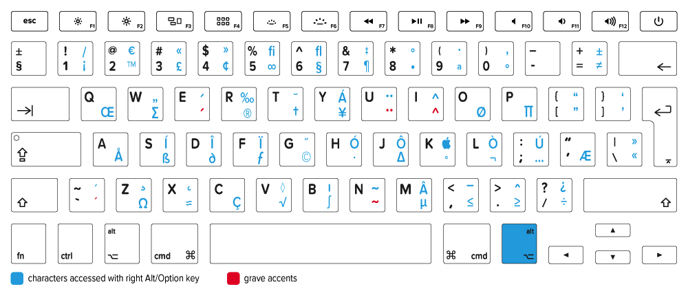

= Characters
:experimental:

== Typography

`•` Bullet, kbd:[Opt+8], asterisk on key looks like bullet

`°` Open bullet, kbd:[Sh+Opt+8], alternate of bullet

`·` Middle dot, kbd:[Sh+Opt+9], next to bullet variants, `9` has ring in it

`–` En dash, kbd:[Opt+-], a better dash than `-`

`—` Em dash, kbd:[Sh+Opt+-], a bigger better dash than `-`

`…` Ellipsis, kbd:[Opt+:], three dots on `;` `:` key

`¶` Paragraph, kbd:[Opt+7], same shape as `7`

`§` Section, kbd:[Opt+6], similar to two ``6``’s

`†` Dagger, kbd:[Opt+t], looks like a `t`

`‡` Double-dagger, kbd:[Sh+Opt+7], looks like a `7`

`◊` Lozenge, diamond, kbd:[Sh+Opt+v], two ``v``’s

== Quotation Marks

`“` `”` Double quotes, kbd:[Opt+[], kbd:[Sh+Opt+[], close to `"`, `'`

`‘` `’` Single quotes, kbd:[Opt+\]], kbd:[Sh+Opt+\]], close to `"`, `'`

`«` `»` Guillemets, kbd:[Opt+\ ], kbd:[Sh+Opt+\ ], close to `"`, `'`

`‹` `›` Single guillemets, kbd:[Sh+Opt+3], kbd:[Sh+Opt+4]

== Legal

`™` Trademark, kbd:[Opt+2], two ≈ trade

`®` Registered, kbd:[Opt+r], ``r``egistered

`©` Copyright, kbd:[Opt+g], two rings in `g`

== Spanish / French / German

`ç` C cedilla, _Façade_, kbd:[Opt+c]

`ñ` Enyay (eñe), _Mañana_, kbd:[Opt+n], start tilde - common tilde char: `n`

`é` E acute, _Résumé_, kbd:[Opt+e], start acute - common accute char: `e`

`à` A grave accent, _Vis-à-vis_, kbd:[Opt+\`], start grave accent - same char as `````

`î` I circumflex, _Maître d’_, kbd:[Opt+i], start circumflex: `i` in circumflex

`ü` U umlaut, _Müde_, kbd:[Opt+u], start umlaut - `u` for umlaut

`ß` Eszett, _Straße_, kbd:[Opt+s], sharp `s`

`¡` Spanish exclamation, _¡Olé!_, kbd:[Opt+1], same key as `!`

`¿` Spanish question, _¿Qué?_, kbd:[Sh+Opt+/] which is kbd:[Opt+?]

== Currency / Finance

`¢` Cent, kbd:[Opt+4], same key as `$`

`£` Pound, kbd:[Opt+3], same key as `#`

`¥` Yen, kbd:[Opt+y], looks like `Y`

`€` Euro, kbd:[Sh+Opt+2], close to `#` & `$`

`ƒ` Florin, ƒ-stop, MacOS folder suffix

`‰` Per-mille, kbd:[Sh+Opt+r], rate

== Greek

`Ω` Omega, kbd:[Opt+Z], last letter in each alphabet

`π` `∏` Pi, kbd:[Opt+p], kbd:[Sh+Opt+P], `P` = Pi

`∑` Sigma, kbd:[Opt+W], rotated sigma

`∂` Alt lower delta, kbd:[Opt+D]

`∆` Delta, kbd:[Opt+J]

`µ` Mu, kbd:[Opt+M], `M` = mu

`ı` Iota, kbd:[Sh+Opt+B]

== Superscripts

`¹` One - Footnote¹

`²` Two - Squared, `cm²`

`³` Three - Cubed

`⁺` Plus, positive, `Na⁺`

`⁻` Minus, negative, `Cl⁻`, `OH⁻`

== Subscripts

`₀` Zero, aught, naught, `t₀`

`₁` One

`₂` Two - Water `H₂O`

`₃` Three - Hydronium Ion `H₃O⁺`

`₄` Four - Sulfuric Acid `H₂SO₄`

== Fractions

`½` One Half

`¼` One Fourth

`¾` Three Fourths

`⅓` One Third

`⅔` Two Thirds

`⅛` One Eighth

`⅜` Three Eighths

`⅝` Five Eighths

`⅞` Seven Eighths

== Mathematical

https://en.wikipedia.org/wiki/Mathematical_Operators_(Unicode_block)[Mathematical Operators]

https://en.wikipedia.org/wiki/Number_Forms[Number_Forms]

`º` Degrees, kbd:[Opt+0], looks like `0`

`≈` Approximately equal, kbd:[Opt+x], `x` is common variable

`≠` Not equal, kbd:[Opt+=], alternate `=`

`≤` `≥` Less / Greater than or equal to, kbd:[Opt+,] kbd:[Opt+.] , same keys as `<` `>`

`¬` Negation / not, kbd:[Opt+l], a rotated & flipped `L`

`÷` Obelus, kbd:[Opt+/], alternate `/`

`±` Plus minus, kbd:[Sh+Opt+=] or kbd:[Opt++], alternate `pass:[+]`

`⁄` Slash, kbd:[Sh+Opt+1], like a `1`

`√` Surd, kbd:[Opt+v], has `v` shape

`∫` Integral, kbd:[Opt+B]

`∈` Element Of

`∉` Not an Element Of

`∋` Contains Member

== Key Symbols

https://support.apple.com/en-us/HT201236[Mac keyboard shortcuts]

`⌥` Option

`⇧` Shift

`⌃` Control

`⌘` Command

`⇪` Caps Lock

`↩` Return

`⌤` Enter

`⎋` Escape

`⇥` Tab Forward

`⇤` Tab Back

`⌫` Delete Back

`⌦` Delete Forward

`↖` Home

`↘` End

`⇞` Page Up

`⇟` Page Down

`⇡` Up Arrow

`⇣` Down Arrow

`⇠` Left Arrow

`⇢` Right Arrow

`⌧` Clear

`⏏` Eject

`⌽` Power



https://keyshorts.com/blogs/blog/41999105-the-ultimate-guide-to-macbook-keyboard[the-ultimate-guide-to-macbook-keyboard]

